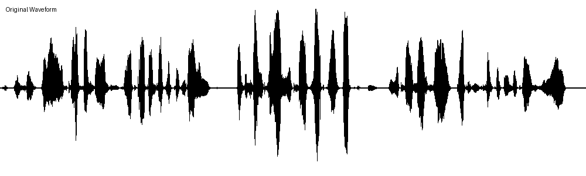
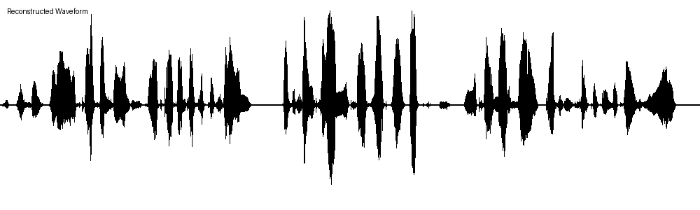
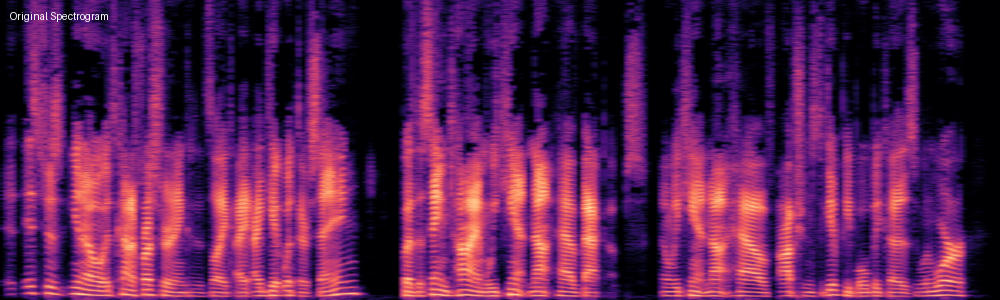
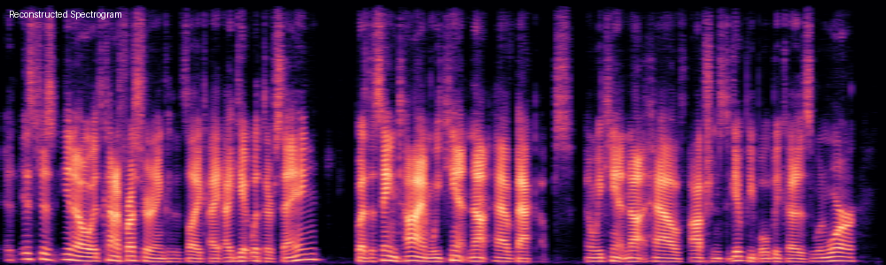
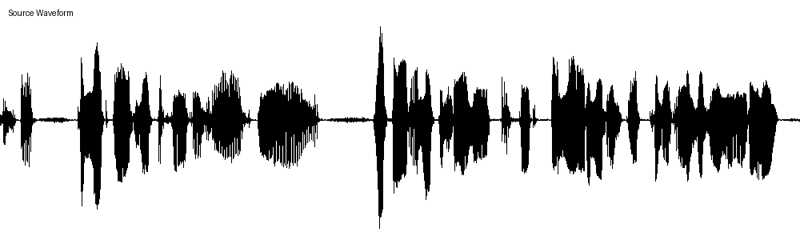
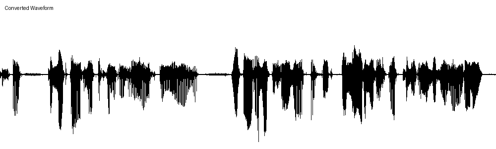
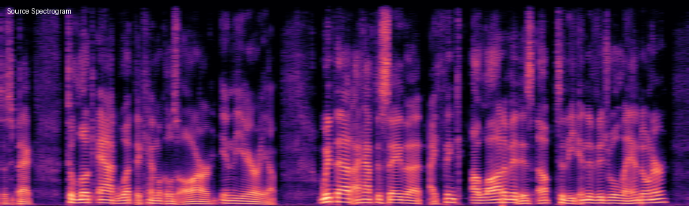
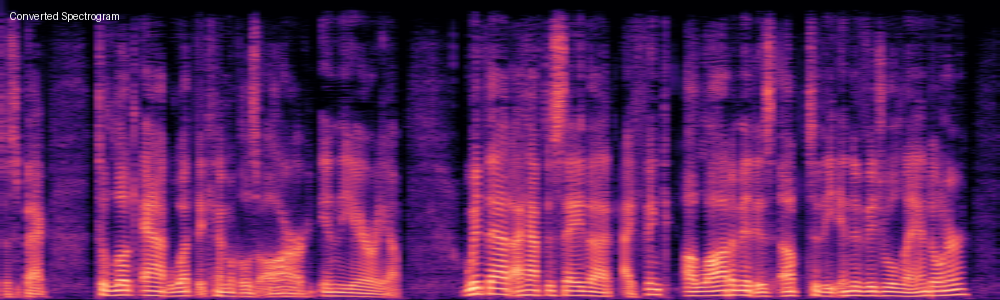

# 实验四：使用 FACodec 实现语音离散化、特征解耦、重构以及音色转换

## 一、实验目标

使用 FACodec 模型实现对语音的离散化、特征解耦、重构以及音色转换。通过这一系列操作，实现语音特征的独立提取，并通过音色转换技术，使用不同说话人的音色重构语音。

---

## 二、实验原理

### 2.1 FACodec 模型架构

FACodec 是一种基于自编码器架构的语音处理模型，源自 NaturalSpeech 3（Amphion 项目）。模型由两大部分组成：

- **FACodecEncoder（编码器）**：通过深度神经网络将输入的连续语音信号转化为潜在表示。通过逐步下采样（stride 为 [2, 4, 5, 5]，hop_length=200），将原始 16kHz 波形压缩到 256 维的特征空间，输出形状为 `[B, 256, T]`。

- **FACodecDecoder（解码器）**：首先利用残差向量量化（Residual Vector Quantization, RVQ）将连续特征离散化，然后解耦出不同类型的语音特征，最后通过上采样重建波形。

### 2.2 语音离散化原理

语音离散化是将连续的语音特征映射到有限集合的离散编码的过程，核心机制是**向量量化（Vector Quantization, VQ）**：

1. 编码器输出形状为 `[B, 256, T]` 的连续特征，每个时间步对应一个 256 维向量
2. 解码器维护多个可学习的码本（Codebook），每个码本包含 1024 个码向量，维度为 8
3. 对每个时间步的输入向量，计算其与码本中所有码向量的距离，选择最近邻的码向量作为量化结果
4. 量化后特征从 `[1, 256, 762]` 变为 `[1, 1, 762]`（离散标签），每个时间步被压缩为一个类别标签

**离散化的意义**：
- 将连续高维特征压缩为离散标签，大幅降低数据量
- 离散表示更具可解释性，不同码字对应不同的语音属性
- 便于后续的语音生成、编辑和转换任务
- 离散编码对噪声和微小扰动更加鲁棒

### 2.3 语音特征解耦原理

FACodec 使用**多码本残差向量量化**实现特征解耦，将语音分解为四个独立部分：

| 特征类型 | 量化器数量 | 物理含义 |
|---------|-----------|---------|
| **Prosody（语调）** | 1 个 VQ | 语音的节奏、韵律、音调变化（F0 相关） |
| **Content（内容）** | 2 个 VQ | 与说话内容相关的语言结构信息（Phone 相关） |
| **Acoustic Detail（残差）** | 3 个 VQ | 高频成分和细微声学细节 |
| **Timbre/Speaker（音色）** | Transformer Encoder | 说话人的全局音色特征（256 维向量） |

**解耦的关键设计**：
1. **残差量化**：前一个量化器的重建结果从输入中减去，后续量化器只对残差建模，天然形成互补的特征分离
2. **梯度反转层（Gradient Reversal）**：对 Content 特征施加 F0 预测器 + 梯度反转，迫使 Content 编码器不保留语调信息；对 Prosody 特征施加 Phone 预测器 + 梯度反转，迫使 Prosody 编码器不保留内容信息
3. **AdaIN 说话人注入**：说话人特征通过自适应实例归一化注入解码过程，与内容/语调/细节特征独立

---

## 三、实验环境

| 组件 | 版本 |
|------|------|
| Python | 3.10 |
| PyTorch | 2.1.2 |
| TorchAudio | 2.1.2 |
| Librosa | 0.10.1 |
| NumPy | <2 |

```bash
conda create -n facodec python=3.10
conda activate facodec
pip3 install torch==2.1.2 torchaudio==2.1.2
pip install librosa==0.10.1 pyworld einops soundfile "numpy<2" matplotlib "setuptools<70"
```

---

## 四、实验步骤与结果

### Step 1：实例化 FACodecEncoder 和 FACodecDecoder

从 `ckpt/` 目录加载预训练模型参数：

```python
fa_encoder = FACodecEncoder(
    ngf=32, up_ratios=[2, 4, 5, 5], out_channels=256,
)
fa_decoder = FACodecDecoder(
    in_channels=256, upsample_initial_channel=1024, ngf=32,
    up_ratios=[5, 5, 4, 2],
    vq_num_q_c=2, vq_num_q_p=1, vq_num_q_r=3,
    vq_dim=256, codebook_dim=8,
    codebook_size_prosody=10, codebook_size_content=10, codebook_size_residual=10,
    use_gr_x_timbre=True, use_gr_residual_f0=True, use_gr_residual_phone=True,
)
fa_encoder.load_state_dict(torch.load("ckpt/ns3_facodec_encoder.bin"))
fa_decoder.load_state_dict(torch.load("ckpt/ns3_facodec_decoder.bin"))
```

### Step 2：加载测试音频

使用 librosa 加载 `speaker2.wav`，采样率 16kHz，转换为 PyTorch 张量：

```python
wav = librosa.load("samples/speaker2.wav", sr=16000)[0]
wav_t = torch.from_numpy(wav).float().unsqueeze(0).unsqueeze(0)
```

**输出**：`Test Audio Shape: torch.Size([1, 1, 152418])`

含义：`[batch_size=1, channels=1(单声道), time_samples=152418(约9.5秒)]`

### Step 3：使用 FACodec 进行语音离散化和解耦

#### Step 3.1 编码器嵌入

```python
encoder_out = fa_encoder(test_wav)
```

**输出**：`Encoder_out Shape: torch.Size([1, 256, 762])`

含义：`[batch_size=1, feature_dimension=256, time_length=762]`，编码器将 152418 个采样点压缩为 762 个时间步的 256 维特征。

#### Step 3.2 离散化解耦（VQ IDs）

```python
_, vq_id, _, _, spk_embs = fa_decoder(encoder_out, eval_vq=False, vq=True)
prosody_code = vq_id[:1]      # 语调离散编码
cotent_code = vq_id[1:3]      # 内容离散编码
detail_code = vq_id[3:]       # 残差离散编码
```

| 输出 | Shape | 含义 |
|------|-------|------|
| `Prosody Code` | `torch.Size([1, 1, 762])` | `[1个prosody量化器, batch=1, time_steps=762]` |
| `Content Code` | `torch.Size([2, 1, 762])` | `[2个content量化器, batch=1, time_steps=762]` |
| `Residual Code` | `torch.Size([3, 1, 762])` | `[3个residual量化器, batch=1, time_steps=762]` |

#### Step 3.3 连续特征解耦（Quantized Embeddings）

```python
_, _, _, quantized = fa_decoder.quantize(encoder_out)
prosody = quantized[0]    # 语调特征
content = quantized[1]    # 内容特征
detail = quantized[2]     # 残差特征
```

| 输出 | Shape | 含义 |
|------|-------|------|
| `Prosody Embedding` | `torch.Size([1, 256, 762])` | `[batch=1, dim=256, time=762]` 语调连续特征 |
| `Content Embedding` | `torch.Size([1, 256, 762])` | `[batch=1, dim=256, time=762]` 内容连续特征 |
| `Detail Embedding` | `torch.Size([1, 256, 762])` | `[batch=1, dim=256, time=762]` 残差连续特征 |
| `Speaker Embedding` | `torch.Size([1, 256])` | `[batch=1, dim=256]` 全局说话人/音色特征 |

#### Step 3.4 混合特征重构

```python
all_embs = prosody + content + detail
rec_wav = fa_decoder.inference(all_embs, spk_embs)
```

**输出**：`Reconstruct Audio Shape: torch.Size([1, 1, 152400])`

**`Successfully Reconstruct!`**

### Step 4：保存重构音频并生成对比图

将重构音频保存为 `speaker2_rec.wav`，并生成原始/重构的波形图和频谱图。

**波形图对比：**

| 原始音频 (speaker2) | 重构音频 (speaker2_rec) |
|---------------------|------------------------|
|  |  |

**频谱图对比：**

| 原始音频 (speaker2) | 重构音频 (speaker2_rec) |
|---------------------|------------------------|
|  |  |

**分析**：重构音频在波形包络和频谱结构上与原始音频高度一致。低频区域的谐波结构保留完整，高频细节略有损失（由于残差量化过程中的信息压缩），但整体语音质量和可懂度保持良好。

### Step 5：音色转换

将 `speaker1.wav` 的语调、内容和细节特征与用户录音（`user.wav`）的音色特征结合：

```python
# 提取 speaker1 的内容特征（Prosody + Content + Detail）
encoder_out_source = fa_encoder(source_wav)
_, _, _, quantized_source = fa_decoder.quantize(encoder_out_source)
prosody_source = quantized_source[0]
content_source = quantized_source[1]
detail_source = quantized_source[2]

# 提取 user 的说话人特征
encoder_out_user = fa_encoder(user_wav)
_, _, _, _, spk_embs_user = fa_decoder(encoder_out_user, eval_vq=False, vq=True)

# 组合 speaker1 的内容 + user 的音色
all_embs_source = prosody_source + content_source + detail_source
rec_wav_with_user = fa_decoder.inference(all_embs_source, spk_embs_user)
```

**`Successfully Convert Voice!`**

#### 音色转换前后对比

**波形图对比：**

| 原始音频 (speaker1) | 音色转换后 (speaker1 → user) |
|---------------------|------------------------------|
|  |  |

**频谱图对比：**

| 原始音频 (speaker1) | 音色转换后 (speaker1 → user) |
|---------------------|------------------------------|
|  |  |

**分析**：转换后的音频保留了 `speaker1.wav` 的语调节奏和语言内容，但音色特征替换为录制用户的音色。频谱图中可以看到整体频谱包络发生了变化（反映音色差异），而谐波结构和共振峰轨迹（反映内容）得以保持。

---

## 五、Tensor 维度含义详解

| 张量名称 | Shape | 各维度含义 |
|----------|-------|-----------|
| `test_wav` | `[1, 1, 152418]` | `[batch_size=1, channels=1, time_samples=152418]` 单声道 16kHz 音频约 9.5 秒 |
| `encoder_out` | `[1, 256, 762]` | `[batch_size=1, feature_dim=256, time_steps=762]` 编码器输出的连续潜在表示 |
| `prosody_code` | `[1, 1, 762]` | `[num_quantizers=1, batch=1, time=762]` 语调的离散编码索引 |
| `content_code` | `[2, 1, 762]` | `[num_quantizers=2, batch=1, time=762]` 内容的离散编码索引 |
| `residual_code` | `[3, 1, 762]` | `[num_quantizers=3, batch=1, time=762]` 残差的离散编码索引 |
| `prosody` | `[1, 256, 762]` | `[batch=1, dim=256, time=762]` 语调的连续特征向量 |
| `content` | `[1, 256, 762]` | `[batch=1, dim=256, time=762]` 内容的连续特征向量 |
| `detail` | `[1, 256, 762]` | `[batch=1, dim=256, time=762]` 残差的连续特征向量 |
| `spk_embs` | `[1, 256]` | `[batch=1, speaker_dim=256]` 全局说话人/音色特征向量 |
| `rec_wav` | `[1, 1, 152400]` | `[batch=1, channels=1, time_samples=152400]` 重构后的音频波形 |

> **注意**：VQ Code 的 shape 中 batch_size 被调整到了第二维度（`[num_quantizers, batch, time]`），这是 RVQ 的实现惯例。

---

## 六、总结

本次实验成功完成了以下任务：

1. **语音离散化**：通过残差向量量化将连续语音特征 `[1, 256, 762]` 压缩为离散编码，Prosody（1 个量化器）、Content（2 个量化器）、Residual（3 个量化器）合计 6 组离散标签序列

2. **特征解耦**：利用多码本 VQ + 梯度反转机制，将语音分解为 Prosody、Content、Acoustic Detail 和 Speaker Embedding 四个独立分量，各分量之间相互独立

3. **语音重构**：成功从解耦特征重建语音（`speaker2_rec.wav`），重构音频与原始音频在波形和频谱上高度一致

4. **音色转换**：成功实现了跨说话人的音色转换——保留 speaker1 的语调/内容/细节，使用用户录音的音色进行重建（`speaker1_rec_with_user.wav`），验证了特征解耦的有效性
